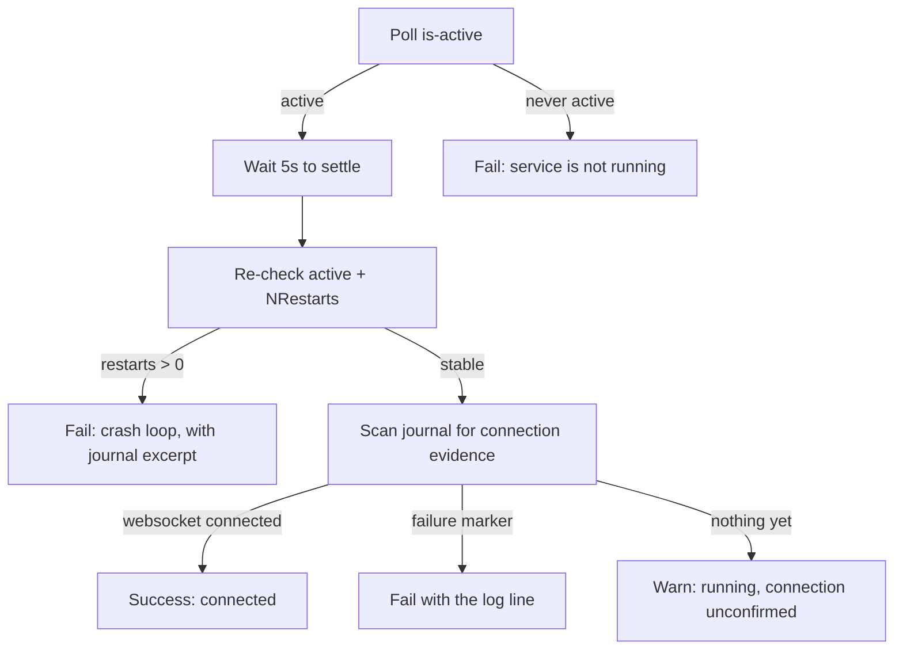

# Agent

The agent is a single static Go binary that runs beside a Docker Engine,
connects outbound to the platform over WebSocket, and never listens on a port.

---

## Responsibilities

| Responsibility | Detail |
| --- | --- |
| Registration | Announce identity, hostname, OS, architecture and version on every connection |
| Heartbeat | Prove liveness every 30 seconds |
| Container discovery | Answer `container.list` with what Docker reports |
| Container inspection | Answer `container.inspect` with Docker inspect data |
| Container lifecycle | Execute `start`, `stop`, `restart` and report the outcome |
| Log streaming | Stream container logs in batched chunks while a subscription is open |
| Reconnection | Re-establish the session automatically after any interruption |

The agent is deliberately **reactive**: it performs work the platform asks for
and reports results. It holds no policy of its own.

---

## Installation layout

| Path | Mode | Purpose |
| --- | --- | --- |
| `/usr/local/bin/docksight-agent` | `0755` | The binary |
| `/etc/docksight-agent/config.yaml` | `0640` | Configuration |
| `/etc/docksight-agent/identity.json` | `0600` | Durable identity, written by the agent |
| `/etc/systemd/system/docksight-agent.service` | `0644` | systemd unit |

---

## Configuration

```yaml title="/etc/docksight-agent/config.yaml"
# DockSight Agent configuration
# Written by "docksight agent install". Edit and restart the service:
#   sudo systemctl restart docksight-agent.service

agent:
  data_dir: "/etc/docksight-agent"
  identity_file: "/etc/docksight-agent/identity.json"

server:
  # DockSight platform WebSocket endpoint for agent registration
  url: "wss://platform.example.com/agents"

docker:
  socket: "/var/run/docker.sock"

logging:
  level: "info"
```

| Key | Default | Meaning |
| --- | --- | --- |
| `agent.data_dir` | `/etc/docksight-agent` | Working directory for agent state |
| `agent.identity_file` | `<data_dir>/identity.json` | Where the UUID is persisted |
| `server.url` | — | Platform WebSocket endpoint. Required. |
| `docker.socket` | `/var/run/docker.sock` | Engine socket. On Windows, `\\.\pipe\docker_engine`. |
| `logging.level` | `info` | `debug`, `info`, `warn`, `error` |

Apply changes with:

```bash
sudo systemctl restart docksight-agent
```

!!! tip "The installer rewrites this file"
    `agent install` and `agent update` regenerate `config.yaml` so a changed
    platform URL takes effect. Hand edits to other keys are overwritten — set
    them again after an upgrade, or open an issue if you need them preserved.

### URL normalization

The installer accepts a human-friendly platform URL and derives the endpoint:

| Input | Result |
| --- | --- |
| `https://platform.example.com` | `wss://platform.example.com/agents` |
| `http://10.0.0.5:2002` | `ws://10.0.0.5:2002/agents` |
| `platform.example.com` | `wss://platform.example.com/agents` |
| `https://example.com/docksight` | `wss://example.com/docksight/agents` |
| `https://platform.example.com//` | `wss://platform.example.com/agents` |

Paths are joined so that duplicate slashes can never yield `//agents`, and an
`/agents` suffix you type yourself is not repeated.

---

## Identity

On first connection the agent generates a UUID v4 and writes it to
`identity.json`:

```json title="/etc/docksight-agent/identity.json"
{
  "id": "bc2bc07d-e456-4979-9f11-3293965d7436",
  "created_at": "2026-07-31T22:14:03.114Z"
}
```

This file is what makes a host *the same host* across restarts, upgrades and
reinstalls. The platform keys its agent record on this UUID.

!!! danger "Never delete identity.json casually"
    Deleting it makes the agent generate a new UUID, and the platform will treat
    the machine as a brand-new host — the old record becomes an orphan that
    never comes back online. Copying it to another machine is worse: two agents
    would claim one identity.

The installer never creates or overwrites this file. It is created by the agent
itself on first connection, and preserved by every subsequent install or update.

!!! note "Why the installer does not pre-create it"
    The agent loads the file if it exists and **fails to start** if it exists
    without a valid `id`. An empty or `{}` placeholder would therefore break
    every boot, so the installer leaves the path free for the agent to fill.

---

## The systemd service

```ini title="/etc/systemd/system/docksight-agent.service"
[Unit]
Description=DockSight Agent
Documentation=https://github.com/Open-Source-Kigali/docksight
After=docker.service network.target network-online.target
Wants=network-online.target
Requires=docker.service

[Service]
Type=simple
ExecStart=/usr/local/bin/docksight-agent --config /etc/docksight-agent/config.yaml
Restart=always
RestartSec=5s

User=root
Group=root

StandardOutput=journal
StandardError=journal
SyslogIdentifier=docksight-agent

[Install]
WantedBy=multi-user.target
```

Why each directive is there:

- **`Requires=docker.service`, `After=docker.service`** — the agent's only job is
  reading the Docker socket. Starting before the Engine guarantees a failed
  first attempt.
- **`network-online.target`** — avoids a first connection attempt against an
  interface that has no address yet.
- **`Restart=always` with `RestartSec=5s`** — the agent should survive platform
  restarts and network drops. Without the delay, a crash-looping agent would
  hammer the platform.
- **`User=root`** — the Docker socket is root-owned. See
  [Security](security.md#the-docker-socket).

### Managing the service

```bash
sudo systemctl status docksight-agent
sudo systemctl restart docksight-agent
sudo systemctl stop docksight-agent
sudo systemctl disable --now docksight-agent

journalctl -u docksight-agent -f
journalctl -u docksight-agent -n 100 --no-pager
```

!!! info "`docksight agent start|stop|restart|status|logs` are placeholders"
    Those commands exist in the CLI but return
    `not implemented yet`. Use `systemctl` and `journalctl` for now — see the
    [Roadmap](roadmap.md#in-progress).

---

## Installation verification

The last phase of `agent install` does not trust `systemctl is-active` alone.
`systemctl start` returns as soon as the process is forked, so a service that
dies on a bad configuration still reports active for a moment.



The journal scan matches the agent's real log output — `websocket connected`,
`registration acknowledged` for success; `websocket dial`, `registration failed`,
`agent session ended`, `connection refused` for failure.

Three outcomes are possible, and they mean different things:

| Outcome | Meaning |
| --- | --- |
| `✓ Agent connected to wss://...` | Registered successfully |
| `⚠ running but no connection confirmed yet` | The service is healthy; the journal simply has no connection line yet. Follow with `journalctl -u docksight-agent -f`. |
| `✗ service failed to start: ... (N restarts)` | Crash loop; the diagnostic includes the journal excerpt |

---

## Updating

```bash
sudo docksight agent update
sudo docksight agent update --version v0.0.13
sudo docksight agent update --url https://new-platform.example.com
```

`agent update` reads the platform URL from the existing config so you do not
retype it. The binary is replaced by an atomic rename, so a running agent is
upgraded in place without a corrupted-binary window, and the service is
restarted afterwards.

Re-running `agent install` performs exactly the same work — `update` only adds
reading the URL from disk instead of requiring `--url`.

---

## Running the agent manually

Useful for debugging outside systemd:

```bash
sudo /usr/local/bin/docksight-agent --config /etc/docksight-agent/config.yaml
```

Set `logging.level: debug` in the config for verbose output, including heartbeat
confirmations.

---

## Windows support

The agent's Docker client supports Windows named pipes
(`\\.\pipe\docker_engine`) and the binary cross-compiles for Windows. However:

- No Windows **installer** exists — the CLI installs a systemd unit, which
  Windows does not have.
- The release pipeline builds agent binaries only for `linux/amd64` and
  `linux/arm64`.

See the [Roadmap](roadmap.md#agent) and the
[FAQ](faq.md#can-i-install-docksight-on-windows-or-macos).

---

## Related

- [WebSocket protocol](websocket-protocol.md) — what the agent sends and receives
- [Installation](installation.md#agent-installation) — walkthrough
- [Security](security.md#the-docker-socket) — what running as root means
