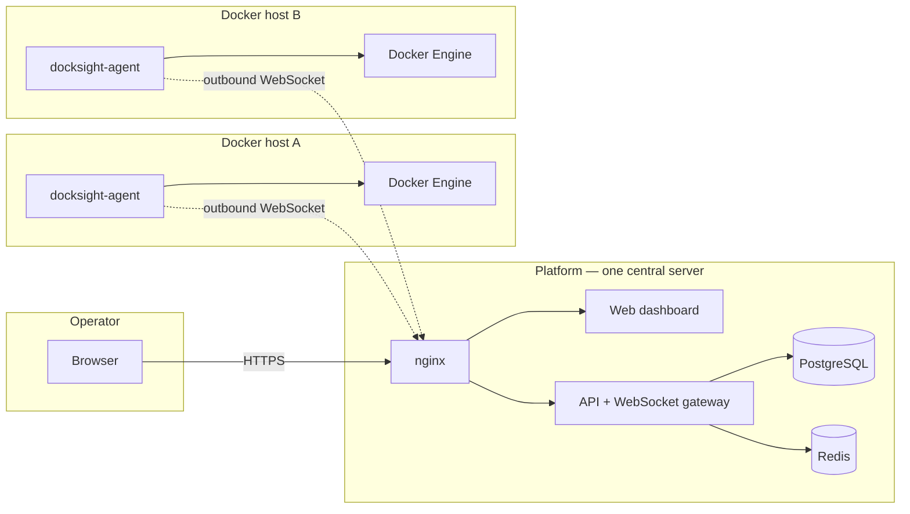

# DockSight

**Manage every Docker host you own from one dashboard — without opening a single inbound port on any of them.**

DockSight is an open-source Docker management and observability platform. A central **platform** runs the dashboard, API and database; lightweight **agents** run beside each Docker Engine and connect *outbound* to the platform over WebSocket.

---

## The shape of it



Every dotted line is initiated **by the agent**. Hosts behind NAT, in another cloud, or on a home network need no port forwarding, no VPN and no public IP. See [Architecture](architecture.md) for why this direction was chosen.

---

## Install in three commands

=== "Platform (central server)"

    ```bash
    curl -fLO https://github.com/Open-Source-Kigali/docksight/releases/latest/download/docksight-cli-v0.0.1-linux-amd64
    chmod +x docksight-cli-v0.0.1-linux-amd64
    sudo ./docksight-cli-v0.0.1-linux-amd64 install
    ```

    Installs the CLI to `/usr/local/bin/docksight`, unpacks the platform into
    `/opt/docksight`, generates credentials, and starts the Docker Compose
    stack. Full walkthrough: [Installation](installation.md#platform-installation).

=== "Agent (each Docker host)"

    ```bash
    curl -fLO https://github.com/Open-Source-Kigali/docksight/releases/latest/download/docksight-cli-v0.0.1-linux-amd64
    chmod +x docksight-cli-v0.0.1-linux-amd64
    sudo ./docksight-cli-v0.0.1-linux-amd64 agent install --url https://platform.example.com
    ```

    Installs the agent, writes `/etc/docksight-agent/config.yaml`, registers a
    systemd service and verifies the connection. Full walkthrough:
    [Installation](installation.md#agent-installation).

!!! tip "Use `-f` with curl"
    `curl -fLO` fails on a 404 instead of silently saving GitHub's HTML error
    page over your binary. This is the single most common installation problem —
    see the [FAQ](faq.md#i-downloaded-the-binary-and-got-syntax-error-newline-unexpected).

---

## Where to go next

<div class="grid cards" markdown>

-   :material-book-open-variant: **New here?**

    Start with [Introduction](introduction.md) for the concepts, then
    [Architecture](architecture.md) for how the pieces fit together.

-   :material-download: **Installing**

    [Installation](installation.md) covers platform, agent, upgrades,
    requirements and troubleshooting.

-   :material-console: **Using the CLI**

    [CLI reference](cli.md) documents every command with real output.

-   :material-lan-connect: **Integrating**

    [WebSocket protocol](websocket-protocol.md) explains the wire format;
    [protocol.md](protocol.md) is the field-level specification.

-   :material-shield-lock: **Running it safely**

    [Security](security.md) is honest about what is protected today and what
    is not.

-   :material-map: **What's coming**

    [Roadmap](roadmap.md) separates what is built from what is planned.

</div>

---

## Project status

DockSight is under active development. The installation system, agent lifecycle
and container operations are implemented and usable; authentication and
transport encryption for agent connections are **not yet implemented**.

!!! warning "Not production-hardened yet"
    Agent connections are currently unauthenticated — any process that can
    reach `/agents` can register as an agent. Run DockSight on a trusted
    network or behind a VPN until token authentication lands. See
    [Security](security.md#current-limitations) for the full picture.

| Area | Status |
| --- | --- |
| Platform installation and upgrades | Implemented |
| Agent installation and upgrades | Implemented |
| Agent registration, heartbeat, reconnect | Implemented |
| Container list, inspect, start/stop/restart | Implemented |
| Container log streaming | Implemented |
| Metrics collection | Planned |
| Agent authentication (tokens) | Planned |
| TLS for agent connections | Supported via `wss://`, not enforced |

The full breakdown lives in the [Roadmap](roadmap.md).
