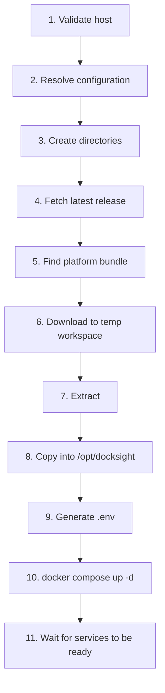
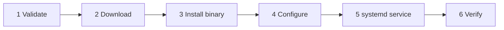

# Installation

DockSight has two installations that are performed independently: the
**platform** on one central server, and an **agent** on each Docker host you
want to manage.

Both are driven by the same `docksight` CLI, and both are **idempotent** —
re-running an install is the supported way to upgrade.

---

## Requirements

### Platform host

| Requirement | Detail |
| --- | --- |
| Operating system | Linux or Windows (x86-64 or ARM64) |
| Docker Engine | Installed and running, in **Linux-container mode** |
| Docker Compose | v2 plugin (`docker compose`, not `docker-compose`) |
| Privileges | root or `sudo` on Linux; an Administrator prompt on Windows |
| Network | Outbound HTTPS to `api.github.com` and `ghcr.io`; inbound on the dashboard port (default `2002`) |
| Disk | ~2 GB for images and volumes |

!!! warning "On Windows the platform does not survive an unattended reboot"
    The engine is Docker Desktop's, and it starts with the Docker Desktop
    application in a user session. After a reboot the platform stays down until
    somebody signs in. See [Windows](#windows) below.

### Agent host

| Requirement | Detail |
| --- | --- |
| Operating system | Linux or Windows (x86-64 or ARM64) |
| Docker Engine | Installed and running |
| Service manager | systemd as PID 1 on Linux; the Service Control Manager on Windows |
| Privileges | root or `sudo` on Linux; an Administrator prompt on Windows |
| Network | Outbound to the platform URL. **No inbound ports required.** |

!!! warning "macOS is not supported"
    Both installers reject it at validation:
    `DockSight installs on linux and windows, this host runs darwin`.

The installer verifies all of this before writing anything. If a requirement is
missing it stops at validation, leaving the host untouched.

---

## Platform installation

### 1. Download the CLI

```bash
curl -fLO https://github.com/Open-Source-Kigali/docksight/releases/latest/download/docksight-cli-v0.0.13-linux-amd64
chmod +x docksight-cli-v0.0.13-linux-amd64
```

Use `-linux-arm64` if `uname -m` reports `aarch64`.

!!! danger "Always use `curl -f`"
    Without `-f`, curl saves GitHub's HTML 404 page *as your binary* when a URL
    is wrong. Running it then produces the baffling
    `Syntax error: newline unexpected`, because the shell is trying to execute
    HTML. `-f` turns that into a clean failure.

### 2. Run the installer

```bash
sudo ./docksight-cli-v0.0.13-linux-amd64 install
```

### What happens



Expected output:

```text
→ [1/5] Checking operating system
✓ Checking operating system
→ [2/5] Checking architecture
✓ Checking architecture
→ [3/5] Checking Docker Engine
✓ Checking Docker Engine
→ [4/5] Checking Docker daemon
✓ Checking Docker daemon
→ [5/5] Checking Docker Compose
✓ Checking Docker Compose
→ DockSight configuration:
→ CLI binary:        /usr/local/bin/docksight
→ Install directory: /opt/docksight
→ Data directory:    /var/lib/docksight
→ Port:              2002
→ Installing the CLI into /usr/local/bin/docksight
✓ CLI installed from /root/docksight-cli-v0.0.13-linux-amd64
→ Checking the latest DockSight release
✓ Latest release v0.0.13
✓ Installer package docksight-platform-v0.0.13.tar.gz found
→ Downloading installer package
✓ Download completed
✓ Platform installed
✓ Generated /opt/docksight/.env
→ Starting DockSight services
→ Waiting for services to become ready
✓ postgres: running (healthy)
✓ redis: running (healthy)
✓ server: running
✓ web: running
✓ nginx: running
✓ DockSight is running on http://localhost:2002
```

### 3. Open the dashboard

```text
http://<your-server>:2002
```

### What was installed

| Path | Contents |
| --- | --- |
| `/usr/local/bin/docksight` | The CLI itself, self-installed from the binary you ran |
| `/opt/docksight/` | Compose file, nginx config, `VERSION`, `.env`, `state.json` |
| `/var/lib/docksight/` | Runtime data that survives reinstalls |

!!! tip "The CLI installs itself"
    After a platform install you can delete the downloaded file and use
    `docksight` directly. This works because the installer replaces the binary
    by renaming a new file over it, so the running process is undisturbed —
    see [Platform](platform.md#self-installation).

### Windows

The platform runs the same five Linux containers on Windows. Nothing is ported;
the images are unchanged, and the Engine that runs them is Docker Desktop in
Linux-container mode.

```powershell
# From an Administrator PowerShell
.\docksight.exe install
```

Preflight adds two checks Linux does not have. **Linux container mode**, because
an Engine switched to Windows containers cannot run any of the five images and
fails with a manifest error that never mentions the mode. And **Administrator
rights**, checked before anything is downloaded, because the install writes
outside the user's own directories.

#### What was installed

| Path | Contents |
| --- | --- |
| `C:\Program Files\DockSight\docksight.exe` | The CLI itself |
| `C:\ProgramData\DockSight\platform\` | Compose file, nginx config, `VERSION`, `.env`, `state.json` |
| `C:\ProgramData\DockSight\data\` | Runtime data that survives reinstalls |

`ProgramFiles` and `ProgramData` are read from the environment, so a machine
that keeps them elsewhere is honoured.

Two machine-wide changes are made as well, both idempotent:

- `C:\Program Files\DockSight` is added to the **machine PATH** under `HKLM`,
  and a `WM_SETTINGCHANGE` broadcast tells Explorer to re-read it. Open a new
  terminal for `docksight` to resolve.
- An inbound **Windows Firewall** rule named *DockSight Platform* opens TCP 2002
  on the domain and private profiles. Without it the dashboard answers on this
  machine and agents elsewhere cannot connect — a failure that looks nothing
  like a closed port.

#### Credentials on Windows

`.env` holds `POSTGRES_PASSWORD` and `JWT_SECRET`. Windows ignores the `0600`
mode Go asks for, so the file would otherwise inherit the ACL of its parent
under `ProgramData` — which grants ordinary users read, and on many machines
write. The installer replaces that with an explicit, non-inherited ACL granting
only `BUILTIN\Administrators` and `NT AUTHORITY\SYSTEM`. It is reapplied on
every install, so an installation made before this existed is repaired by
re-running it.

```powershell
icacls 'C:\ProgramData\DockSight\platform\.env'
```

#### Reboots

**The platform does not come back on its own.** Docker Desktop's engine starts
with its desktop application in a user session, so a host sitting at a sign-in
screen has no engine and nothing to restart the containers. `docksight install`
says so when it finishes rather than leaving it to be discovered during an
outage.

Enable *Start Docker Desktop when you sign in* and sign in after a reboot, or
run the platform on a Linux host if unattended restarts matter.

---

## Agent installation

Run this on **each Docker host** you want to manage.

### 1. Download the CLI

```bash
curl -fLO https://github.com/Open-Source-Kigali/docksight/releases/latest/download/docksight-cli-v0.0.13-linux-amd64
chmod +x docksight-cli-v0.0.13-linux-amd64
```

### 2. Install the agent

```bash
sudo ./docksight-cli-v0.0.13-linux-amd64 agent install --url https://platform.example.com
```

Omit `--url` and the installer prompts for it interactively.

### URL normalization

You give the installer a **platform URL**; it derives the WebSocket endpoint.
All of these produce `wss://platform.example.com/agents`:

| You type | Stored as |
| --- | --- |
| `https://platform.example.com` | `wss://platform.example.com/agents` |
| `https://platform.example.com/` | `wss://platform.example.com/agents` |
| `https://platform.example.com///` | `wss://platform.example.com/agents` |
| `https://platform.example.com/agents` | `wss://platform.example.com/agents` |
| `platform.example.com` | `wss://platform.example.com/agents` |
| `http://10.0.0.5:2002` | `ws://10.0.0.5:2002/agents` |

`https` maps to `wss`, `http` to `ws`, and a missing scheme defaults to the
secure one. Duplicate slashes can never produce `//agents`.

!!! warning "Check the port"
    `http://10.0.0.5:200` and `http://10.0.0.5:2002` are both *valid* and the
    installer will accept either. A wrong port installs cleanly and then fails
    to connect. The default platform port is **2002**.

### The six phases



Expected output:

```text
→ Agent binary:  /usr/local/bin/docksight-agent
→ Configuration: /etc/docksight-agent/config.yaml
→ Service:       docksight-agent.service
→ Platform:      wss://platform.example.com/agents
→ Validating the host
→ [1/6] Checking operating system
✓ Checking operating system
...
→ [6/6] Checking internet connectivity
✓ Checking internet connectivity
→ Checking the latest DockSight release
✓ Latest release v0.0.13
→ Downloading docksight-agent-v0.0.13-linux-amd64
✓ Agent binary installed at /usr/local/bin/docksight-agent
→ Writing /etc/docksight-agent/config.yaml
✓ Configured platform wss://platform.example.com/agents
→ Identity will be created at /etc/docksight-agent/identity.json on first connection
→ Creating the systemd service
✓ Unit written to /etc/systemd/system/docksight-agent.service
✓ Service enabled at boot
→ Starting docksight-agent.service
→ Waiting for services to become ready
✓ docksight-agent.service is running
✓ Agent connected to wss://platform.example.com/agents
✓ DockSight Agent installed and connected
```

### What was installed

| Path | Contents |
| --- | --- |
| `/usr/local/bin/docksight-agent` | The agent binary |
| `/etc/docksight-agent/config.yaml` | Platform URL, Docker socket, log level (mode `0640`) |
| `/etc/docksight-agent/identity.json` | Durable UUID, created by the agent on first connection |
| `/etc/systemd/system/docksight-agent.service` | The unit |

### Pin a version

```bash
sudo ./docksight-cli-v0.0.13-linux-amd64 agent install \
  --url https://platform.example.com --version v0.0.13
```

Useful when an agent must match a platform that has not been upgraded yet.

---

## Upgrading

### Platform

```bash
sudo docksight update                    # CLI + platform to latest
sudo docksight update --platform         # platform only
sudo docksight update --cli              # CLI only, no stack restart
sudo docksight update --version v0.0.13  # pin, or roll back
sudo docksight update --force            # re-apply the current version
```

The platform update replaces `/opt/docksight`, recreates the stack and waits for
health. Two things survive: your generated `.env` (so credentials still match
the existing PostgreSQL volume) and the named volumes themselves.

!!! note "Brief downtime"
    A platform update runs `compose down` then `up`. It is not a rolling
    upgrade; expect a short outage.

### Agent

```bash
sudo docksight agent update                    # latest
sudo docksight agent update --version v0.0.13  # pinned, or rolled back
sudo docksight agent update --url https://new-platform.example.com
```

`agent update` reads the platform URL back from the existing config, so you do
not retype it — which is also how a wrong port gets introduced. Identity is
preserved, so the host keeps its registration and history.

If the CLI is not on PATH on that host (agent installs do not self-install the
CLI), either use the downloaded binary directly, or install it once:

```bash
sudo mv docksight-cli-v0.0.13-linux-amd64 /usr/local/bin/docksight
```

---

## Verifying an installation

=== "Platform"

    ```bash
    docksight version
    docker compose -f /opt/docksight/dockersight-installation.yml ps
    curl -I http://localhost:2002
    ```

=== "Agent"

    ```bash
    systemctl status docksight-agent
    journalctl -u docksight-agent -n 50 --no-pager
    cat /etc/docksight-agent/identity.json
    ```

A healthy agent journal contains `websocket connected` followed by
`registration acknowledged`.

---

## Troubleshooting

??? failure "`Syntax error: newline unexpected` when running the binary"

    The file is not a binary — it is GitHub's HTML 404 page, saved because the
    download URL was wrong and `curl` was not given `-f`.

    ```bash
    file docksight-cli-*         # expect: ELF 64-bit LSB executable
    head -c 16 docksight-cli-* | od -c
    ```

    If you see `<!DOCTYPE`, re-download with `curl -fLO` and confirm the release
    actually publishes that asset.

??? failure "`Permission denied` when executing the binary"

    The execute bit is missing. GitHub serves assets over plain HTTP with no
    mode information, so every download lands as `0644`.

    ```bash
    chmod +x docksight-cli-v0.0.13-linux-amd64
    ```

??? failure "`cannot execute binary file: Exec format error`"

    Wrong architecture. Check with `uname -m`: `x86_64` needs `-linux-amd64`,
    `aarch64` needs `-linux-arm64`.

??? failure "`release vX.Y.Z publishes no asset matching docksight-agent-*`"

    The release exists but no agent binary was uploaded to it. The error lists
    the assets that *are* published. Fix it on the release side:

    ```bash
    bash scripts/publish-release.sh vX.Y.Z
    ```

    See [Release process](release-process.md).

??? failure "`the Docker daemon is not running`"

    ```bash
    sudo systemctl start docker
    sudo systemctl enable docker
    ```

    If the message says *permission denied* instead, you are not root and your
    user is not in the `docker` group. Use `sudo`.

??? failure "`systemd is not the init system on this host`"

    The agent is installed as a systemd unit, so systemd must be PID 1. This
    commonly appears in containers and in WSL without systemd enabled. For WSL,
    add to `/etc/wsl.conf` and restart with `wsl --shutdown`:

    ```ini
    [boot]
    systemd=true
    ```

??? failure "`no internet connectivity: cannot reach https://api.github.com`"

    The installer downloads releases from GitHub. On an air-gapped host you
    cannot install this way today; the artifacts would need to be staged
    manually.

??? failure "Agent installs but never connects"

    The service is running but no `websocket connected` line appears.

    ```bash
    journalctl -u docksight-agent -n 50 --no-pager
    grep url /etc/docksight-agent/config.yaml
    ```

    Most common causes: wrong port in the platform URL, platform not reachable
    from that host, or a firewall blocking egress. Test reachability directly:

    ```bash
    curl -I http://platform.example.com:2002
    ```

??? failure "Platform install fails at `open /tmp/...: permission denied`"

    An older release staged downloads at a fixed `/tmp` path, which collides
    with a root-owned file left by a previous `sudo` run. Current versions stage
    in a private per-run directory. Upgrade the CLI, or remove the stale file.

---

## Uninstalling

=== "Platform"

    ```bash
    docker compose -f /opt/docksight/dockersight-installation.yml down
    sudo rm -rf /opt/docksight /var/lib/docksight /usr/local/bin/docksight
    ```

    Add `-v` to the compose command to delete the database volumes too. **That
    destroys all data.**

=== "Agent"

    ```bash
    sudo systemctl disable --now docksight-agent
    sudo rm /etc/systemd/system/docksight-agent.service
    sudo systemctl daemon-reload
    sudo rm -rf /etc/docksight-agent /usr/local/bin/docksight-agent
    ```

    Removing `identity.json` means the host registers as a *new* host if you
    reinstall later.

!!! info "`docksight agent uninstall` is not implemented yet"
    The command exists in the CLI but returns
    `docksight agent uninstall is not implemented yet`. Use the manual steps
    above. Tracked in the [Roadmap](roadmap.md#in-progress).
