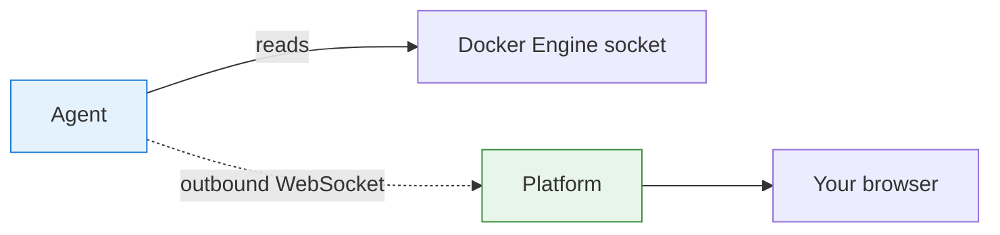
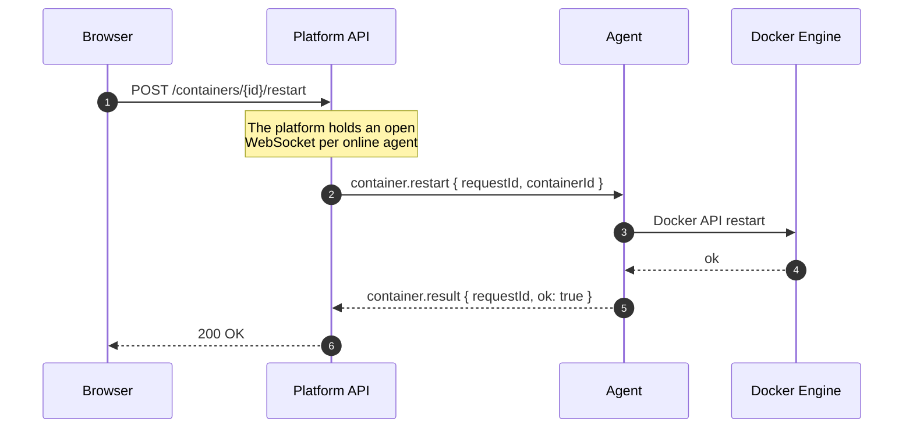

# Introduction

This page explains what DockSight is, the problem it solves, and the vocabulary
used throughout the rest of the documentation. No installation required — read
[Installation](installation.md) when you are ready to run something.

---

## The problem

Docker gives you excellent tooling for **one** host. The moment you have more
than one, the experience degrades sharply:

- `docker ps` over SSH, one terminal per host.
- No single view of what is running where.
- Hosts behind NAT, in a home lab, or in a different cloud are painful to reach
  at all.
- Exposing the Docker Engine API over TCP to manage hosts remotely is a serious
  security risk: the Docker socket is **root-equivalent** access to the host.

The usual answers each carry a cost. Publishing the Docker API means guarding a
root-equivalent endpoint. A VPN mesh means running and maintaining a VPN.
A full orchestrator means adopting Kubernetes for workloads that may not want it.

## The DockSight answer

Put a small **agent** next to each Docker Engine and have it dial *out* to a
central **platform**.

The Docker socket is never exposed to the network. The agent reads it locally
and speaks a narrow, purpose-built protocol to the platform. Because the agent
initiates the connection, the host it runs on needs **no inbound firewall rule,
no port forward, and no public IP**.

---

## The two deliverables

DockSight ships as two independent products, released together but installed
separately.

-   :material-server: **Platform**

    Runs once, on a central server. Dashboard, API, WebSocket gateway,
    PostgreSQL, Redis and nginx, orchestrated with Docker Compose.

    Installed with `docksight install` into `/opt/docksight`.

    [Read more →](platform.md)

-   :material-lan: **Agent**

    Runs on every Docker host you want to manage. A single Go binary
    supervised by systemd.

    Installed with `docksight agent install` into
    `/usr/local/bin/docksight-agent`.

    [Read more →](agent.md)

A third artifact, the **CLI** (`docksight`), installs and updates both. It is
never bundled inside the platform archive, and the platform is never bundled
inside the CLI — see [Release process](release-process.md) for why that
separation is enforced.

---

## Vocabulary

Terms used consistently across this documentation:

| Term | Meaning |
| --- | --- |
| **Platform** | The central server: dashboard, API, gateway, database, proxy. One per deployment. |
| **Agent** | The process on a Docker host that talks to the platform. One per host. |
| **Host** | A machine running Docker Engine, managed through an agent. |
| **Bundle** | The platform release artifact: compose file, nginx config, `.env` template, `VERSION`. |
| **Identity** | A durable UUID the agent persists to disk so it is recognised as the same host across restarts and upgrades. |
| **Registration** | The first message an agent sends after connecting, which creates or updates its record on the platform. |
| **Envelope** | The `{ "type": ..., "payload": ... }` wrapper every protocol message uses. |

---

## How a request actually flows

Understanding this one sequence explains most of DockSight's design. Suppose you
click "restart" on a container in the dashboard:

Three properties fall out of this design:

1. **The platform never connects to the host.** It replies on a socket the agent
   already opened.
2. **Every command is correlated** by `requestId`, so many operations can be in
   flight on one socket at once.
3. **The agent is the only thing that touches Docker.** The platform's authority
   ends at "send a message"; the agent decides what that means locally.

---

## What DockSight is not

Being explicit about scope saves everyone time:

- **Not a Kubernetes tool.** DockSight manages Docker Engine. Kubernetes support
  appears in the [Roadmap](roadmap.md#kubernetes) as a possible future direction,
  not a current goal.
- **Not a CI/CD system.** It observes and controls containers; it does not build
  or deploy images.
- **Not a replacement for a metrics stack.** Prometheus, Grafana and Loki
  integrations are planned as *integrations*, not reimplementations.
- **Not multi-tenant yet.** Authentication, organizations and RBAC are planned.
  Today, access to the dashboard is access to everything.

---

## Next steps

- [Architecture](architecture.md) — components, communication, and the reasoning
  behind the design.
- [Installation](installation.md) — get a platform and an agent running.
- [CLI reference](cli.md) — every command, with real output.
