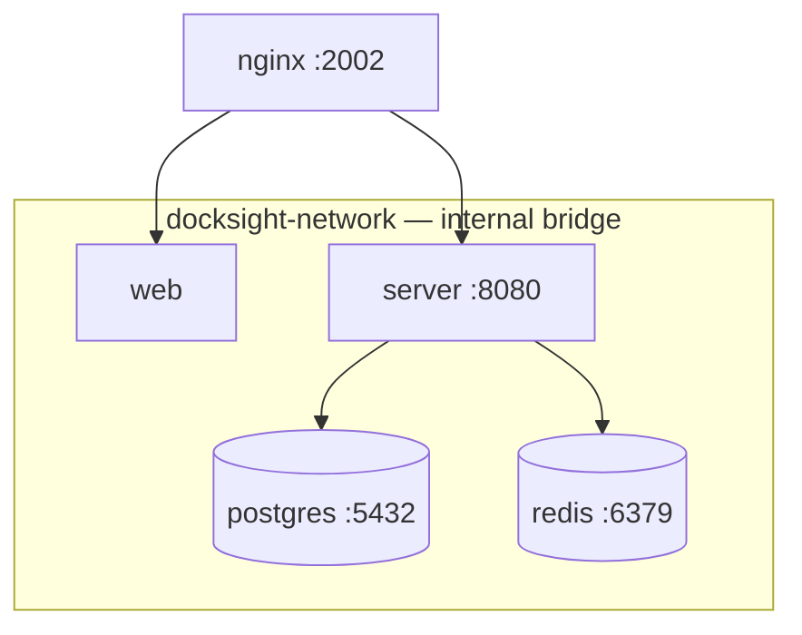

# Platform

The platform is the central half of DockSight: dashboard, API, WebSocket
gateway, database and reverse proxy, delivered as a Docker Compose application
and managed by the `docksight` CLI.

---

## Services



| Service | Container | Published | Health check |
| --- | --- | --- | --- |
| nginx | `docksight-nginx` | `${DOCKSIGHT_PORT:-2002}` → 80 | — |
| web | `docksight-web` | none | — |
| server | `docksight-server` | none | — |
| postgres | `docksight-postgres` | none | `pg_isready` |
| redis | `docksight-redis` | none | `redis-cli ping` |

Only nginx is reachable from outside. `server` depends on `postgres` and `redis`
being **healthy**, not merely started — its entrypoint runs
`prisma migrate deploy` and would exit if the database were not accepting
connections yet.

---

## Filesystem layout

| Path | Purpose |
| --- | --- |
| `/opt/docksight/dockersight-installation.yml` | Compose file |
| `/opt/docksight/default.conf` | nginx configuration |
| `/opt/docksight/.env` | Generated credentials and settings (mode `0600`) |
| `/opt/docksight/VERSION` | Bundle version marker |
| `/opt/docksight/state.json` | What is installed, used by `docksight update` |
| `/var/lib/docksight/` | Runtime data that survives reinstalls |
| `/usr/local/bin/docksight` | The CLI |

Container data lives in Docker named volumes (`postgres-data`, `redis-data`),
not in the install directory — so reinstalling the platform never touches your
database.

---

## Installation phases

`docksight install` runs eleven steps. Each is idempotent.

| # | Phase | Notes |
| --- | --- | --- |
| 1 | Validate host | OS, architecture, Docker Engine, Docker daemon, Compose |
| 2 | Resolve configuration | Paths and port |
| 3 | Create directories | `/opt/docksight`, `/var/lib/docksight` |
| 4 | Install CLI | Copies the running binary to `/usr/local/bin/docksight` |
| 5 | Fetch latest release | GitHub Releases API |
| 6 | Find platform bundle | Asset discovery by naming convention |
| 7 | Download | Into a private per-run temp directory |
| 8 | Extract | Path-traversal-guarded tar extraction |
| 9 | Copy into place | Bundle contents into `/opt/docksight` |
| 10 | Generate `.env` | Only if absent — see below |
| 11 | Start and verify | `compose up -d`, then poll until every service is ready |

### Self-installation

Phase 4 is worth understanding. The installer copies **the executable it is
currently running** to `/usr/local/bin/docksight` — the filename you downloaded
is irrelevant, since it discovers its own path at runtime.

The copy is staged next to the destination and moved into place with a rename.
That matters twice over:

- On Unix you cannot write to a running executable (`ETXTBSY`), but you *can*
  replace its directory entry. The running process keeps its original inode, so
  the installer continues normally after replacing itself.
- The swap is atomic, so an interrupted install can never leave a half-written
  binary on `PATH`.

If you run `sudo /usr/local/bin/docksight install` — installing from the
destination itself — the installer detects that source and destination are the
same file and skips the copy. Without that check it would truncate the binary
mid-execution.

### Environment generation

Phase 10 reads `.env.example` from the bundle and writes `.env`, replacing every
credential-shaped value with fresh entropy:

```ini title="/opt/docksight/.env (generated)"
# DockSight local development infrastructure
POSTGRES_DB=docksight
POSTGRES_USER=docksight
POSTGRES_PASSWORD=L09NY5hFMQW8bE55EoN90_oCSy1F527O4uqc1KwjlWmlFtgLkEZHsGyl63wTp465
POSTGRES_PORT=5432
REDIS_PORT=6371
JWT_SECRET=uhgI06kyo5Hti2lKtd9WLy2E7Fpblm3zs5FNvUJb7zVYTunMTCGL6erYDp_2NCQc
```

Keys containing `PASSWORD`, `SECRET`, `TOKEN`, `KEY`, `SALT` or `CREDENTIAL` get
48 bytes from `crypto/rand`, base64url-encoded. Everything else — database name,
user, ports — is copied verbatim, because Compose references those values by
name (`pg_isready -U ${POSTGRES_USER}`) and randomizing them produces a stack
that cannot pass its own health check.

!!! danger "`.env` is never regenerated"
    If `/opt/docksight/.env` already exists, it is left untouched and the
    installer warns. This is deliberate: PostgreSQL bakes the password into its
    data volume on first boot, so a new `POSTGRES_PASSWORD` would lock the
    server out of its own database, and a new `JWT_SECRET` would invalidate every
    session.

    To rotate credentials you must also reset the corresponding state — for
    Postgres, that means the volume.

The file is written `0600` and owned by whoever ran the install (root). See
[Security](security.md#credentials-on-disk) for what that means for running
`docker compose` by hand.

---

## Service readiness

The installer does not treat "started" as "working". After `compose up -d` it
polls `docker compose ps` until every service is ready, where ready means:

- state is `running`, **and**
- if the service declares a health check, health is `healthy`.

A service that declares a health check but reports `starting` is not ready —
PostgreSQL accepts no connections for the first seconds of its life, and
treating it as ready would let the server begin migrating against a database
that is not listening.

Verification exits early on genuine failure: a container that exited non-zero,
or is `dead`, will never become ready, so waiting out the timeout serves no one:

```text
✗ server: exited (code 3)
Error: service failed to start: server: exited (code 3) (inspect with: docker compose -f dockersight-installation.yml logs)
```

A clean `exited 0` is **not** treated as failure — a one-shot migration
container that finished its job is a normal outcome.

---

## Updating

```bash
sudo docksight update
```

The CLI records what is installed in `/opt/docksight/state.json`:

```json
{
  "cli_version": "v0.0.13",
  "platform_version": "v0.0.13",
  "installed_at": "2026-07-31T22:14:03Z",
  "updated_at": "2026-08-01T09:02:41Z"
}
```

The two versions move independently on purpose: updating the CLI must not force
a platform restart, and vice versa. `update` compares recorded versions against
the target release and skips work that is not needed — `--force` overrides.

| Flag | Effect |
| --- | --- |
| `--cli` | Update only the CLI binary |
| `--platform` | Update only the platform bundle and restart the stack |
| `--version <tag>` | Target a specific release instead of the latest |
| `--force` | Re-apply even when already at that version |

A platform update replaces the bundle, then runs `compose down` and `up` so new
compose definitions take effect. Volumes and `.env` survive.

---

## Operating the stack directly

Everything is ordinary Docker Compose:

```bash
cd /opt/docksight

docker compose -f dockersight-installation.yml ps
docker compose -f dockersight-installation.yml logs -f server
docker compose -f dockersight-installation.yml restart server
docker compose -f dockersight-installation.yml down
```

!!! warning "Run compose as root"
    `.env` is mode `0600` and owned by root. If you run `docker compose` as a
    non-root user in the `docker` group, Compose cannot read it: every variable
    interpolates as empty, `POSTGRES_PASSWORD` becomes blank and Postgres
    refuses to start, while `JWT_SECRET` falls back to the literal placeholder
    in the compose file. Compose reports this only as
    `warning: The "POSTGRES_PASSWORD" variable is not set`.

---

## Configuration

Settings live in `/opt/docksight/.env` and are read by Compose at start.

| Variable | Default | Meaning |
| --- | --- | --- |
| `DOCKSIGHT_PORT` | `2002` | Host port nginx publishes |
| `POSTGRES_DB` | `docksight` | Database name |
| `POSTGRES_USER` | `docksight` | Database role |
| `POSTGRES_PASSWORD` | generated | Database password |
| `POSTGRES_PORT` | `5432` | Internal Postgres port |
| `REDIS_PORT` | `6371` | Internal Redis port |
| `JWT_SECRET` | generated | Token signing key |
| `JWT_EXPIRES_IN` | `12h` | Token lifetime |

After editing:

```bash
cd /opt/docksight
docker compose -f dockersight-installation.yml up -d
```

!!! note "`DOCKSIGHT_PORT` and `JWT_EXPIRES_IN` are not in the generated file"
    The compose file reads them with defaults (`${DOCKSIGHT_PORT:-2002}`), so
    they work without being present. Add them to `.env` if you want to change
    them.

---

## Platform status

```bash
docksight status
```

!!! warning "Placeholder"
    `docksight status` currently prints a fixed string and does **not** inspect
    the running stack. Use `docker compose ps` until it is implemented —
    tracked in the [Roadmap](roadmap.md#in-progress).

---

## Related

- [Installation](installation.md#platform-installation) — step-by-step walkthrough
- [CLI reference](cli.md#docksight-install) — every flag
- [Security](security.md) — credentials, exposure, and current limits
