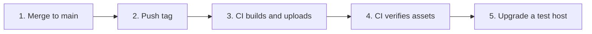

# Release process

Every DockSight release publishes **three kinds of artifact**, built from one
commit and uploaded to one GitHub release.

---

## The artifacts

| Artifact | Filename | Installed by |
| --- | --- | --- |
| Platform bundle | `docksight-platform-<version>.tar.gz` | `docksight install` |
| CLI binary | `docksight-cli-<version>-<os>-<arch>` | Downloaded by the operator; self-installs |
| Agent binary | `docksight-agent-<version>-<os>-<arch>` | `docksight agent install` |

A complete release contains eight files:

```text
docksight-platform-v0.0.13.tar.gz
docksight-cli-v0.0.13-linux-amd64
docksight-cli-v0.0.13-linux-arm64
docksight-cli-v0.0.13-darwin-amd64
docksight-cli-v0.0.13-darwin-arm64
docksight-cli-v0.0.13-windows-amd64.exe
docksight-agent-v0.0.13-linux-amd64
docksight-agent-v0.0.13-linux-arm64
```

The agent is built only for Linux, because it is installed as a systemd service.

### Strict separation

Three rules are enforced by the build and verified by tests:

1. **The CLI is never inside the platform bundle.**
2. **The platform bundle is never inside the CLI.**
3. **The agent ships alone**, because it is installed on different machines than
   either of the other two.

Why this matters: the three components are versioned independently. Bundling
would force a platform restart to update a CLI, or a CLI download to update a
platform. Keeping them separate is what makes `docksight update --cli` possible.

---

## Naming convention

Filenames are a contract between the build script and the installer. They are
declared once, in `apps/cli/cmd/internal/release/asset.go`:

```go
const (
    platformPrefix = "docksight-platform-"
    cliPrefix      = "docksight-cli-"
    agentPrefix    = "docksight-agent-"
    archiveSuffix  = ".tar.gz"

    // Releases up to v0.0.6 used this name for the bundle.
    legacyPlatformPrefix = "docksight-install-"
)
```

The same file exports `PlatformBundleName()`, `CLIBinaryName()` and
`AgentBinaryName()` so packaging and discovery cannot drift apart. A test builds
names with those functions and resolves them back through the discovery
selectors.

### Discovery is by kind, not by filename

Installers never hardcode a filename. They ask for an asset by *kind* and
*target*:

```go
asset, err := rel.PlatformBundle()
asset, err := rel.CLIBinary(release.CurrentTarget())
asset, err := rel.AgentBinary(release.Target{OS: "linux", Arch: "arm64"})
```

Target matching is token-aware, so `amd64` never matches a `linux-arm64` asset —
a naive substring check would hand an ARM machine an x86 binary.

When an asset is missing, the error names what was wanted and what exists:

```text
release v0.0.12 publishes no asset matching docksight-agent-* for linux-amd64
(has: docksight-cli-v0.0.12-linux-amd64, docksight-platform-v0.0.12.tar.gz, ...)
```

---

## Building a release

```bash
scripts/build-release.sh v0.0.14
```

The script:

1. Verifies `bundle/` contains everything the installer expects
   (`dockersight-installation.yml`, `.env.example`, `default.conf`) and refuses
   to build otherwise
2. Writes the version into `bundle/VERSION`
3. Packs `bundle/` into `docksight-platform-v0.0.14.tar.gz`
4. Cross-compiles the CLI for five targets, stamping the version, commit, and
   UTC build date with `-ldflags`
5. Cross-compiles the agent for `linux/amd64` and `linux/arm64`

Output goes to `release/`, which is git-ignored — these are build outputs,
rebuildable from any tag, and binaries do not belong in git history.

```console
$ scripts/build-release.sh v0.0.14
built docksight-platform-v0.0.14.tar.gz
built docksight-cli-v0.0.14-linux-amd64
built docksight-cli-v0.0.14-linux-arm64
built docksight-cli-v0.0.14-darwin-amd64
built docksight-cli-v0.0.14-darwin-arm64
built docksight-cli-v0.0.14-windows-amd64.exe
built docksight-agent-v0.0.14-linux-amd64
built docksight-agent-v0.0.14-linux-arm64

Upload every file above to the v0.0.14 GitHub release.
```

Build elsewhere with `DOCKSIGHT_RELEASE_DIR=/tmp/rel scripts/build-release.sh v0.0.14`.

---

## Publishing a release

Pushing a tag runs `.github/workflows/release.yml`: it builds all eight
artifacts, uploads them, and verifies the release carries every one — no manual
steps.

```bash
git tag v0.0.14 && git push origin v0.0.14
```

The same upload and verification can still be run by hand:

```bash
scripts/publish-release.sh v0.0.14
```

This uploads all eight artifacts **and then verifies against the GitHub API that
the release actually carries them**. That verification is the important part.

!!! warning "The failure this prevents"
    Four consecutive releases (v0.0.9 through v0.0.12) shipped without agent
    binaries even though the build produced them — the loss was entirely in a
    manual upload step. The failure mode is asymmetric and that is why it went
    unnoticed: a missing *platform* asset breaks your own install immediately,
    but a missing *agent* asset only surfaces later, on someone else's remote
    host.

The script also:

- Refuses to upload if any artifact is missing locally, and tells you to build
- Uses `--clobber`, so re-running is safe
- Creates the release if the tag has none
- Warns if the release is a draft or prerelease, because `/releases/latest`
  skips those and installers would silently keep resolving the previous version

Manual equivalent:

```bash
gh release create v0.0.14 release/docksight-*
# or, to add to an existing release
gh release upload v0.0.14 release/docksight-agent-v0.0.14-linux-amd64
```

---

## Full checklist



1. **Merge** everything intended for the release
2. **Tag**: `git tag v0.0.14 && git push origin v0.0.14`
3. **Build & publish** happen automatically: the tag-push workflow runs
   `build-release.sh`, uploads `release/*` to the release, and fails the run if
   any of the eight assets is missing
4. **Verify** the release is not a draft and lists eight assets:
   ```bash
   curl -s https://api.github.com/repos/Open-Source-Kigali/docksight/releases/latest \
     | grep '"name": "docksight'
   ```
5. **Smoke test** on a real host: `sudo docksight update` and
   `sudo docksight agent update`

---

## Versioning

All three artifacts share the release tag. Installations may nonetheless run
mixed versions — that is by design:

| Scenario | Result |
| --- | --- |
| Platform v0.0.13, agents v0.0.13 | Normal |
| Platform v0.0.13, one agent v0.0.9 | Supported; the agent uses only the protocol it knows |
| CLI v0.0.13, platform v0.0.9 | Supported; the CLI resolves assets by kind, not by version |

The protocol's compatibility rules — ignore unknown types, ignore unknown
payload fields — are what make mixed fleets safe. See
[WebSocket protocol](websocket-protocol.md#the-envelope).

`docksight version` reports CLI and platform versions separately, from
`state.json`.

---

## Backward compatibility

`docksight-install-` (the bundle prefix used up to v0.0.6) is still accepted by
platform discovery. A current CLI can therefore install an old release. Do not
remove that alias without checking which releases users may still pin to.

---

## Automation

A GitHub Actions workflow (`.github/workflows/release.yml`) triggers on tag
push: it runs `build-release.sh` and `publish-release.sh`, so the eight
artifacts are built, uploaded, and verified with zero manual steps. A missing
artifact fails the workflow instead of publishing an incomplete release.

---

## Related

- [Development](development.md#building) — building locally
- [CLI reference](cli.md#docksight-update) — how updates consume releases
- [FAQ](faq.md#release-process) — common release questions
