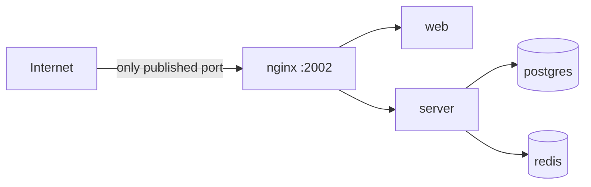

# Security

This page is deliberately blunt about what DockSight protects today and what it
does not. Deploy accordingly.

---

## Current limitations

Read this section before exposing DockSight to an untrusted network.

!!! danger "Agent connections are unauthenticated"
    The `/agents` WebSocket endpoint accepts any connection that reaches it. An
    attacker who can reach the platform can register as an agent, appear in your
    dashboard, and receive container commands intended for a real host.

    Token authentication is the top security item on the
    [Roadmap](roadmap.md#platform). Until it lands, treat network reachability
    of `/agents` as the trust boundary: keep the platform on a private network,
    behind a VPN, or restrict `/agents` by source IP at your proxy.

!!! warning "TLS is supported but not enforced"
    If you install an agent with an `http://` URL, the session is `ws://` —
    plaintext. Nothing warns you at runtime. Every message, including container
    names, log contents and command results, crosses the network in the clear.

    Use `https://` platform URLs so agents negotiate `wss://`.

!!! warning "No authorization model"
    There are no users, roles or scopes for agent operations yet. Access to the
    dashboard is access to every managed host.

---

## The Docker socket

This is the most important thing to understand about running an agent.

**Access to the Docker socket is equivalent to root on the host.** Anyone who can
talk to `/var/run/docker.sock` can start a container that mounts `/` and
therefore read or write any file on the machine, regardless of container
isolation.

The agent runs as `root` and reads the socket directly. That is a deliberate
trade-off, and it is worth being explicit about what it means:

| Consequence | Detail |
| --- | --- |
| The agent is a high-value target | Compromising it is equivalent to compromising the host |
| Platform commands are powerful | The platform can start, stop and restart any container on the host |
| Isolation does not help | No container boundary protects a host whose socket is being used |

What DockSight does to limit exposure:

- **The socket never leaves the host.** It is read locally over a Unix socket;
  the Docker API is never published to the network. This is the primary reason
  the agent exists at all.
- **The agent exposes no inbound port.** There is nothing to connect to.
- **The command surface is narrow.** The agent implements a fixed set of message
  types — list, inspect, start, stop, restart, log streaming — rather than
  proxying arbitrary Docker API calls.

!!! note "Adding a user to the `docker` group grants root"
    This is a Docker property, not a DockSight one, but it surprises people:
    `usermod -aG docker alice` is effectively `alice ALL=(ALL) NOPASSWD: ALL`.

---

## Identity

Each agent generates a UUID v4 on first connection and persists it at
`/etc/docksight-agent/identity.json` (mode `0600`).

```json
{
  "id": "bc2bc07d-e456-4979-9f11-3293965d7436",
  "created_at": "2026-07-31T22:14:03.114Z"
}
```

What identity **is** today: a stable name so the platform recognises a host
across restarts, upgrades and reinstalls.

What identity is **not** today: a credential. It is not secret, not verified, and
not proof of anything. Anyone who can reach `/agents` can claim any UUID.

That is precisely what token authentication will change: registration will
require a secret issued by the platform, and identity will become a claim the
platform can verify.

!!! danger "Never copy identity.json between machines"
    Two agents sharing one UUID means the platform sees a single host whose
    facts flip between two machines — and commands land on whichever connected
    most recently.

---

## Credentials on disk

The platform installer generates credentials with `crypto/rand` — never
`math/rand`, whose output is reconstructible from a few samples and would make
a JWT signing key forgeable.

| File | Mode | Contents |
| --- | --- | --- |
| `/opt/docksight/.env` | `0600` | Database password, JWT secret |
| `/etc/docksight-agent/config.yaml` | `0640` | Platform URL, socket path |
| `/etc/docksight-agent/identity.json` | `0600` | Agent UUID |

Generated values are 48 random bytes rendered as 64 base64url characters. The
alphabet matters: `A–Z a–z 0–9 - _` contains nothing a shell, a compose file or a
PostgreSQL connection string would treat as syntax, so a password can never
break the file it lands in.

### Why `.env` is never regenerated

Re-running the installer leaves an existing `.env` untouched. PostgreSQL bakes
the password into its data volume at first boot; regenerating
`POSTGRES_PASSWORD` on an upgrade would lock the platform out of its own
database, and a new `JWT_SECRET` would invalidate every session. The check is
performed with `O_CREATE|O_EXCL` rather than "stat then write", so two concurrent
installs cannot both decide to write.

### Reading them back

`.env` is `0600` and root-owned, so `sudo cat` is required — and `docker compose`
must also run as root. Running Compose as a non-root user in the `docker` group
means it cannot read `.env`, every variable interpolates empty, and Postgres
refuses to start with a blank password. Compose reports that only as
`warning: The "POSTGRES_PASSWORD" variable is not set`.

---

## Platform isolation



- `postgres` and `redis` publish **no ports**. They are reachable only from the
  internal `docksight-network` bridge.
- `web` and `server` publish no ports either; nginx is the sole entry point.
- Internal services are addressed by container name on a dedicated bridge
  network, not through the host.

The practical consequence: a port scan of the platform host finds one open port.

!!! tip "Terminate TLS in front"
    DockSight ships nginx configured for plain HTTP on `2002`. For anything
    beyond a private network, put a TLS-terminating proxy in front (or extend
    the shipped nginx config with certificates) and use `https://` for the
    dashboard and agent URLs.

---

## Container isolation

DockSight does not sandbox the containers it manages — it observes and controls
them through Docker. Standard Docker security practice still applies to your
workloads:

- Avoid `--privileged` and unnecessary capability grants.
- Do not bind-mount the Docker socket into application containers.
- Prefer read-only root filesystems and non-root users in images.

The platform's own stack follows the parts of this that apply: no service mounts
the Docker socket, and only nginx is exposed. **The agent is the sole component
that touches Docker, and it runs on the host, not in a container.**

---

## Supply chain

Releases are downloaded from the GitHub Releases API over HTTPS. Two properties
of the installer are worth knowing:

**Archive extraction is path-traversal guarded.** A tar entry named
`../../etc/cron.d/x` or `/etc/passwd` is rejected rather than written. Since
installs run as root, an unguarded extractor would let a tampered release write
anywhere on the host. Symlink entries are skipped for the same reason.

**Binaries are replaced atomically.** New binaries are staged next to their
destination and moved into place with a rename, so an interrupted install cannot
leave a half-written executable on `PATH`.

What is **not** done yet:

- No checksum verification of downloaded assets.
- No signature verification.
- No pinning of the release host.

If you need those today, download assets manually, verify them out of band, and
install from a local path.

---

## Hardening checklist

For a deployment beyond a trusted private network:

- [ ] Put the platform behind TLS and use `https://` platform URLs everywhere
- [ ] Restrict `/agents` at the proxy — source IP allow-list or mTLS — until
      token authentication ships
- [ ] Keep the platform off the public internet, or behind a VPN
- [ ] Treat every agent host as root-equivalent to the platform's reach
- [ ] Limit who can read `/opt/docksight/.env`
- [ ] Back up the database volume (`postgres-data`) and `.env` together — the
      password in one must match the volume in the other
- [ ] Watch `journalctl -u docksight-agent` for unexpected reconnect churn

---

## Reporting a vulnerability

Please do not open a public issue for security problems. See
[Contributing](contributing.md#reporting-security-issues) for how to make
private contact.

---

## Related

- [Agent](agent.md#identity) — how identity is created and preserved
- [Platform](platform.md#environment-generation) — credential generation
- [Roadmap](roadmap.md#platform) — authentication, RBAC and audit plans
